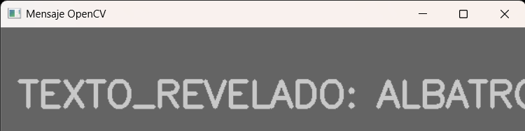
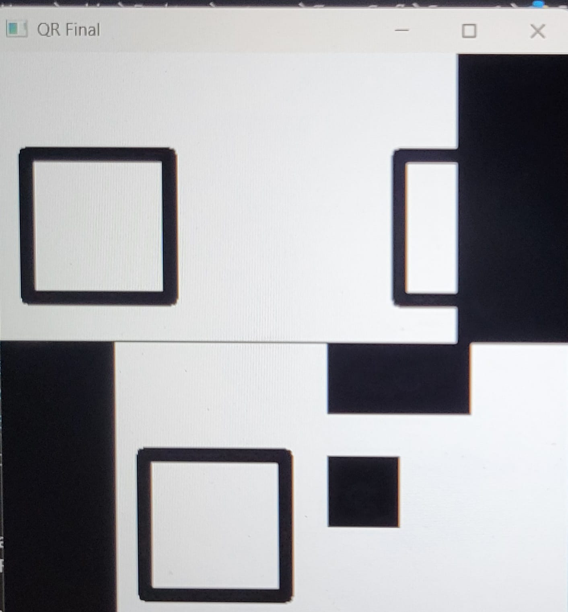
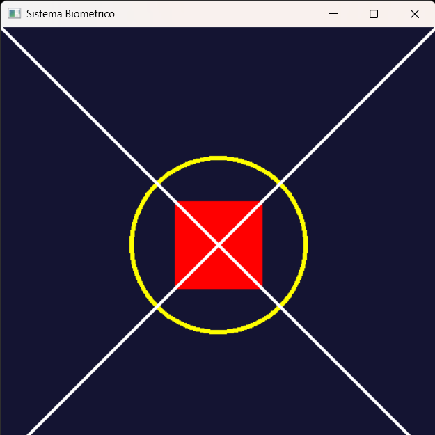
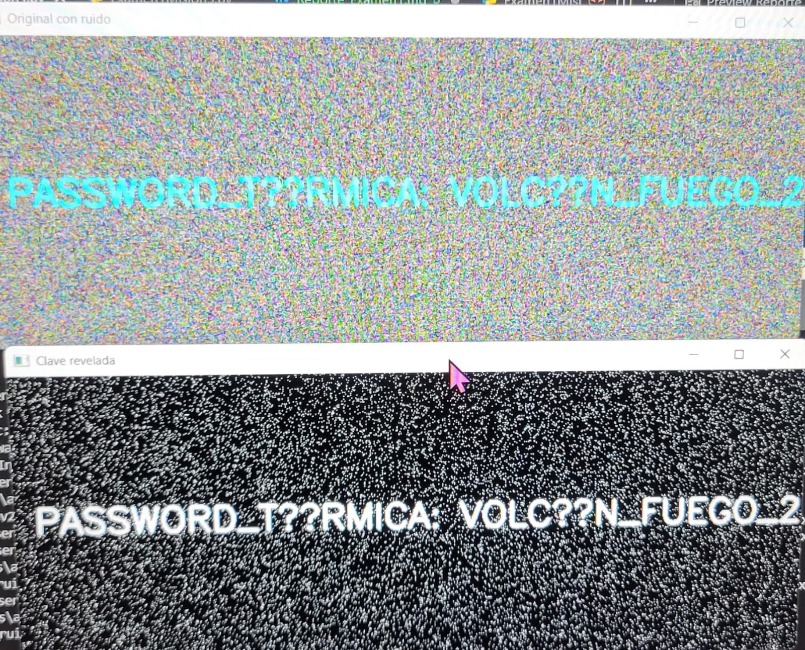
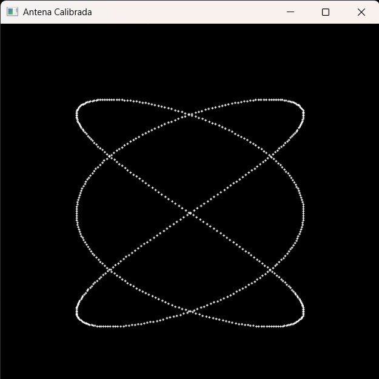

#  Reporte de Misión: Graficación Táctica
**Agente Especial:** [Garcia Garcia Paola/24120372]

---
##  Evidencias de Misión
*MISION 1 *

```python
import cv2
import numpy as np

img = cv2.imread('C:\\Users\\adria\\Desktop\\entorno\\TareasGrafi\\Examen1\\m1_oscura.png', cv2.IMREAD_GRAYSCALE)
# --- MODO RAW ---
h, w = img.shape
img_raw = np.zeros((h, w), dtype=np.uint8)
# Recorre con un for y multiplica por 50
for i in range(h):
    for j in range(w):
        img_raw[i, j] = np.clip(int(img[i, j]) * 50, 0, 255)
# --- MODO OPENCV ---
# Usa la magia de la vectorización 
img_opencv = cv2.multiply(img, 50)

cv2.imshow('Mensaje Raw', img_raw)
cv2.imshow('Mensaje OpenCV', img_opencv)
cv2.waitKey(0)
cv2.destroyAllWindows()

```


---

*MISION 2 *

```python
import cv2
import numpy as np

m1 = cv2.imread('C:\\Users\\adria\\Desktop\\entorno\\TareasGrafi\Examen1\\m2_mitad1.png')
m2 = cv2.imread('C:\\Users\\adria\\Desktop\\entorno\\TareasGrafi\\Examen1\\m2_mitad2.png')


output = np.zeros((400, 400, 3), dtype=np.uint8)

# Transformamos lo de arriba 
t_sup = np.float32([[1, 0, -80], [0, 1, 0]])
upper_part = cv2.warpAffine(m1, t_sup, (400, 400))

# rotamos y ubicamos bien para qeu funcione 
h, w = m2.shape[:2]
r_mat = cv2.getRotationMatrix2D((w // 2, h // 2), 180, 1.0)
m2_rotated = cv2.warpAffine(m2, r_mat, (w, h))

#posicionamos en la parte de abajo 
t_inf = np.float32([[1, 0, 80], [0, 1, 200]])
lower_part = cv2.warpAffine(m2_rotated, t_inf, (400, 400))

# juntamso todoo
final_qr = cv2.add(upper_part, lower_part)

#ya todo junto
cv2.imshow("QR Final", final_qr)
cv2.waitKey(0)
cv2.destroyAllWindows()
```


---

*MISION 3 *

```python
import cv2
import numpy as np

# espacio de trabajo 500x500 y el color azul oscuro se aplica directamente al crear la matriz
sello = np.full((500, 500, 3), (50, 20, 20), dtype=np.uint8)

# definimos los tonos
AMARILLO = (0, 255, 255)
ROJO = (0, 0, 255)
BLANCO = (255, 255, 255)

# circulo amarillo
cv2.circle(sello, (250, 250), 100, AMARILLO, 3)

# rectangulo rojo 
cv2.rectangle(sello, (200, 200), (300, 300), ROJO, -1)

# lineas en X qeu cruzan de esquina a esquina
cv2.line(sello, (0, 0), (500, 500), BLANCO, 2)
cv2.line(sello, (500, 0), (0, 500), BLANCO, 2)

# Almacenamiento y visualizacion
cv2.imwrite("m3_sello_forjado.png", sello)
cv2.imshow("Sistema Biometrico", sello)

cv2.waitKey(0)
cv2.destroyAllWindows()
```


---
*MISION 4 *

```python
import cv2
import numpy as np

foto_ruidosa = cv2.imread('C:\\Users\\adria\\Desktop\\entorno\\TareasGrafi\Examen1\\m4_ruido.png')

# La pasamos a HSV para que se deje filtrar
color_hsv = cv2.cvtColor(foto_ruidosa, cv2.COLOR_BGR2HSV)

#rango sugerido 
el_bajo = np.array([80, 100, 100])
el_alto = np.array([100, 255, 255])

# filtramos para que solo quede lo que nos sirve
solo_cyan = cv2.inRange(color_hsv, el_bajo, el_alto)

# a ver si ya se ve la clave :)
cv2.imshow("Original con ruido", foto_ruidosa)
cv2.imshow("Clave revelada", solo_cyan)

cv2.waitKey(0)
cv2.destroyAllWindows()
```


---
*MISION 5 *

```python
import cv2
import numpy as np
import math

# el lienzo negro que pide la mision
cuadro = np.zeros((500, 500, 3), dtype=np.uint8)

#Empezamos el tiempo en 0
tiempo = 0

#corremos el bucle hasta llegar a 2pi (6.28)
while tiempo <= 6.28:
    
    # Aplicamos las formulas de las pistas para sacar las coordenadas
    # El 250 es para que quede en el centro del cuadro de 500
    pos_x = int(250 + 150 * math.sin(3 * tiempo))
    pos_y = int(250 + 150 * math.sin(2 * tiempo))

    # Dibujamos el punto blanco en la coordenada que salio
    cv2.circle(cuadro, (pos_x, pos_y), 1, (255, 255, 255), -1)

    # Vamos avanzando de poquito en poquito
    tiempo += 0.01

# Mostramos el dibujo de la antena
cv2.imshow("Antena Calibrada", cuadro)
cv2.waitKey(0)
cv2.destroyAllWindows()
```



---
##  Análisis del Analista (Reflexiones Finales)

1. **Sobre los Operadores Puntuales (Misión 1):** Matemáticamente, ¿qué pasaría si en lugar de multiplicar por 50, hubieras sumado 50 a cada píxel oscuro? ¿Se revelaría el texto igual de claro o la imagen perdería contraste?
> *Si hubieramos sumado 50 en lugar de multiplicar, la imagen perderia contraste y el texto no seria claro. La suma hace que el negro se vea gris, pero la multiplicacion expande el rango dinamico, lo cual es necesario para separar los valores casi imperceptibles (1 a 5) y hacer que resalten contra el fondo. *

2. **Sobre el Espacio HSV (Misión 4):** ¿Por qué el modelo de color BGR es ineficiente para la Recuperación de Información cuando buscamos "todos los tonos de azul celeste", y por qué el modelo HSV resuelve este problema con una sola variable?
> *El modelo BGR es ineficiente porque el color esta mezclado en tres canales (Blue, Green, Red) y cuallquier cambio en la iluminacion afecta a los tres. El modelo HSV resuelve esto porque separa la informacion del color  puro en una sola variable: el Hue (Matiz). Asi, podemos seleccionar "todos los celestes" variando solo el componente H, sin importar que tan brillantes o saturados sean. *

3. **Sobre Ecuaciones Paramétricas (Misión 5):** ¿Por qué las ecuaciones paramétricas (usando el parámetro t) son mejores para dibujar formas cerradas y complejas en graficación por computadora que usar la clásica función $y=f(x)$?
> *Las funciones clasicas y=f(x) fallan al dibujar formas cerradas porque para un solo valor de x solo pueden tener un valor de y (no pueden "regresar" o cruzarse). Las ecuaciones parametricas, al depender de un a independiente t, permiten que la coordenada (x, y) se mueva libremente en cualquier direccion, facilitando el dibujo de circulos, infinitos y curvas complejas como las de Lissajous.*