# INSTITUTO TECNOLÓGICO DE MORELIA
**Ingeniería en Sistemas Computacionales**


# Reporte de Misión: Graficación Táctica II 
Agente Especial: [Paola Garcia Garcia/24120372]
## Evidencias
## Misión 1: El Mensaje Oculto (Brillo y Operador Inverso)

### 1. Descripción de la Tarea
El objetivo de esta misión fue recuperar un mensaje oculto en una imagen extremadamente oscura (`m1_oscura.png`). Para lograrlo, se aplicó un operador inverso multiplicando el valor de cada píxel por un factor de 50. Se implementaron tres enfoques: un procesamiento manual por ciclos anidados (Modo RAW con clipping), una solución vectorizada con NumPy y el uso directo de las funciones optimizadas de OpenCV.

- IMAGEN OSCURA


- CAPTURA CON MODO OpenCV
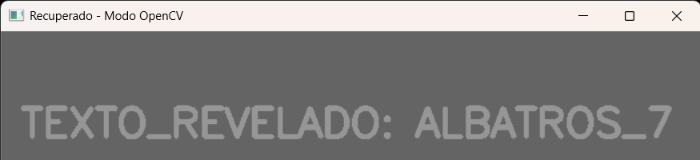

- CAPTURA CON MODO RAW
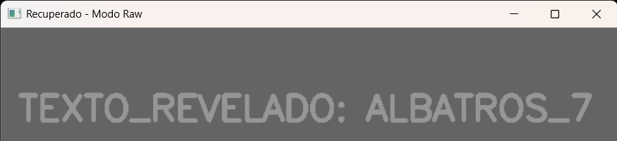


- Código de la Solución:
```python
import cv2
import numpy as np

img = cv2.imread("C:\\Users\\adria\\Desktop\\entorno\\TareasGrafi\\Examen2\\m1_oscura 1.png", cv2.IMREAD_GRAYSCALE)

# MODO RAW (Ciclos Anidados)
# Este metodo es educativo para entender como se procesa cada pixel
h, w = img.shape
img_raw = np.zeros((h, w), dtype=np.uint8)

for i in range(h):
    for j in range(w):
        # Aplicamos el operador inverso (Multiplicacion por 50)
        nuevo_valor = int(img[i, j]) * 50
        
        # Clipping manual: Si supera 255, se queda en 255 (blanco total)
        if nuevo_valor > 255:
            nuevo_valor = 255
            
        img_raw[i, j] = nuevo_valor

# MODO OPENCV / NUMPY (Vectorizado)
# Opcion A: Usando NumPy con clip
img_numpy = np.clip(img.astype(np.uint16) * 50, 0, 255).astype(np.uint8)

# Opcion B: Usando OpenCV (el metodo mas directo)
img_opencv = cv2.multiply(img, 50)

#  RESULTADOS 
cv2.imshow('Mensaje Original (Oscuro)', img)
cv2.imshow('Recuperado - Modo Raw', img_raw)
cv2.imshow('Recuperado - Modo OpenCV', img_opencv)

print("Misoón completada. Pixeles restaurados.")
cv2.waitKey(0)
cv2.destroyAllWindows()
```


MISION 2:
- QR reconstruido: 
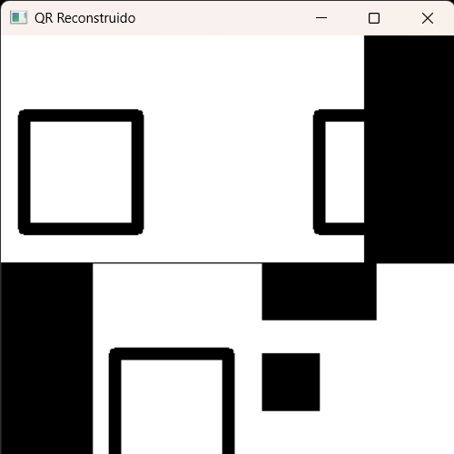

- Mitad 1:
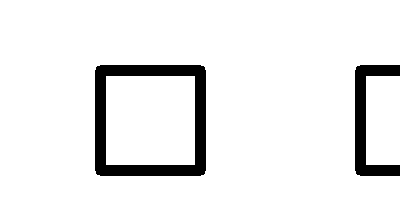
- Segunda mitad

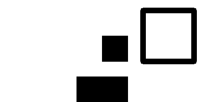
- Codigo:
```python
import cv2
import numpy as np

# Cargamos los pedazos del QR
parte1 = cv2.imread("C:\\Users\\adria\\Desktop\\entorno\\TareasGrafi\\Examen2\\m2_mitad1 1.png")
parte2 = cv2.imread("C:\\Users\\adria\\Desktop\\entorno\\TareasGrafi\\Examen2\\m2_mitad2 1.png")

# Creamos el fondo blanco de 400x400 como pide el profe
fondo = np.full((400, 400, 3), 255, dtype=np.uint8)

# --- 1. ACOMODAR LA MITAD SUPERIOR ---
# Matriz para mover la pieza de arriba y dejarla en su lugar (origen)
matriz_arriba = np.float32([[1, 0, -80], [0, 1, 0]])
mitad1_lista = cv2.warpAffine(parte1, matriz_arriba, (400, 400))

# --- 2. ENDEREZAR Y ACOMODAR LA MITAD INFERIOR ---
alto, ancho = parte2.shape[:2]
centro_pieza = (ancho // 2, alto // 2)

# Matriz para quitarle la rotación de 180 grados
matriz_giro = cv2.getRotationMatrix2D(centro_pieza, 180, 1.0)
mitad2_derecha = cv2.warpAffine(parte2, matriz_giro, (ancho, alto))

# Matriz para mandar la pieza ya derecha a la parte de abajo del lienzo
matriz_abajo = np.float32([[1, 0, 80], [0, 1, 200]])
mitad2_lista = cv2.warpAffine(mitad2_derecha, matriz_abajo, (400, 400))

# --- 3. ENSAMBLAR EL QR ---
# Juntamos las dos partes usando cv2.add para que se fusionen en el fondo
qr_armado = cv2.add(mitad1_lista, mitad2_lista)

# Guardamos el resultado con el nombre exacto que nos pidieron
cv2.imwrite("m2_qr_reconstruido.png", qr_armado)

# Mostramos cómo quedó en pantalla
cv2.imshow("QR Reconstruido", qr_armado)
cv2.waitKey(0)
cv2.destroyAllWindows()
```

---

MISION 3:
- Sello forjado:
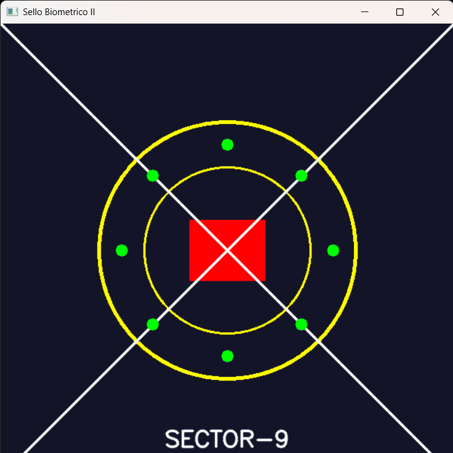
- Código:
```python
import cv2
import numpy as np
import math

# Crear el lienzo de 600x600 con el color base BGR(40, 20, 20)
img = np.zeros((600, 600, 3), dtype=np.uint8)
img[:] = (40, 20, 20)

# Centro del lienzo
centro_x, centro_y = 300, 300

# 1. Dibujar círculo exterior amarillo (radio 170, grosor 3)
cv2.circle(img, (centro_x, centro_y), 170, (0, 255, 255), 3)

# 2. Dibujar círculo interior amarillo (radio 110, grosor 2)
cv2.circle(img, (centro_x, centro_y), 110, (0, 255, 255), 2)

# 3. Dibujar rectángulo rojo relleno (-1 o cv2.FILLED indica que es sólido)
cv2.rectangle(img, (250, 260), (350, 340), (0, 0, 255), -1)

# 4. Dibujar las 2 diagonales blancas (X) de esquina a esquina
cv2.line(img, (0, 0), (600, 600), (255, 255, 255), 2)
cv2.line(img, (0, 600), (600, 0), (255, 255, 255), 2)

# 5. Colocar 8 círculos verdes alrededor del centro a distancia 140
distancia = 140
radio_verde = 8
color_verde = (0, 255, 0)

for i in range(8):
    # Calcular el ángulo para cada uno de los 8 puntos (360 grados / 8 = 45 grados o pi/4 radianes)
    angulo = i * (2 * math.pi / 8)
    
    # Calcular las coordenadas x e y usando seno y coseno
    x = int(centro_x + distancia * math.cos(angulo))
    y = int(centro_y + distancia * math.sin(angulo))
    
    # Dibujar el círculo verde relleno (-1)
    cv2.circle(img, (x, y), radio_verde, color_verde, -1)

# 6. Escribir el texto "SECTOR-9" en la parte baja (centrado aprox)
texto = "SECTOR-9"
fuente = cv2.FONT_HERSHEY_SIMPLEX
escala = 1
color_blanco = (255, 255, 255)
grosor_texto = 2

# Calculamos el tamaño del texto para que quede perfectamente centrado en x
tamaño_texto = cv2.getTextSize(texto, fuente, escala, grosor_texto)[0]
texto_x = centro_x - (tamaño_texto[0] // 2)
texto_y = 560

cv2.putText(img, texto, (texto_x, texto_y), fuente, escala, color_blanco, grosor_texto, cv2.LINE_AA)

# 7. Guardar como m3_sello_forjado_v2.png
cv2.imwrite('m3_sello_forjado_v2.png', img)

# Opcional: Mostrar la imagen en pantalla para revisar que todo esté bien
cv2.imshow('Sello Biometrico II', img)
cv2.waitKey(0)
cv2.destroyAllWindows()
```
---
MISION 4:
- Máscara Cyan: 
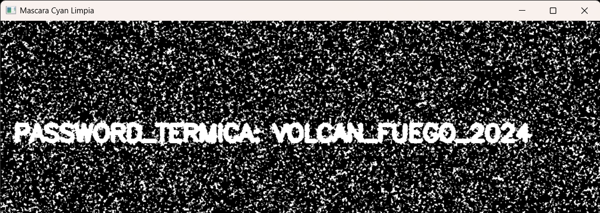
- Imagen con ruido
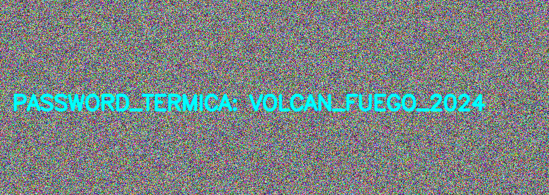
- Imagen suavizada
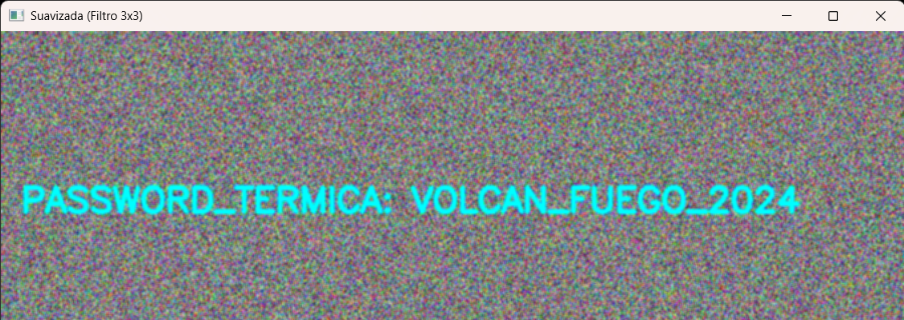
- Código:
```python
import cv2
import numpy as np

# 1. Cargar la imagen con ruido
img = cv2.imread("C:\\Users\\adria\\Desktop\\entorno\\TareasGrafi\\Examen2\\m4_ruido 1.png")

if img is None:
    print("Error: No se pudo encontrar la imagen 'm4_ruido.png'. Asegúrate de que esté en la misma carpeta.")
else:
    # 2. Definir kernel promedio 3x3 (float32) y normalizar dividiendo entre 9
    kernel = np.ones((3, 3), dtype=np.float32) / 9.0
    
    # Aplicar la convolución usando cv2.filter2D (-1 mantiene la misma profundidad que la imagen original)
    img_suavizada = cv2.filter2D(img, -1, kernel)
    
    # 3. Guardar la imagen suavizada (Opcional)
    cv2.imwrite("m4_suavizada.png", img_suavizada)
    
    # 4. Convertir la imagen suavizada a espacio de color HSV
    img_hsv = cv2.cvtColor(img_suavizada, cv2.COLOR_BGR2HSV)
    
    # 5. Definir límites low y high para el color Cyan (Cian)
    # Hue en OpenCV va de 0 a 180. El cian está en ~90.
    low_cyan = np.array([70, 50, 50])
    high_cyan = np.array([110, 255, 255])
    
    # 6. Crear la máscara binaria con cv2.inRange
    mask_cyan = cv2.inRange(img_hsv, low_cyan, high_cyan)
    
    # 7. Guardar la máscara resultante
    cv2.imwrite("m4_mask_cyan.png", mask_cyan)
    
    print("¡Misión 4 completada con éxito!")
    print("Se han guardado 'm4_suavizada.png' y 'm4_mask_cyan.png'")

    # Opcional: Mostrar los resultados en pantalla para verificar la limpieza
    cv2.imshow("Original con Ruido", img)
    cv2.imshow("Suavizada (Filtro 3x3)", img_suavizada)
    cv2.imshow("Mascara Cyan Limpia", mask_cyan)
    cv2.waitKey(0)
    cv2.destroyAllWindows()
```

---
MISION 5:
- Mensaje recuperado:
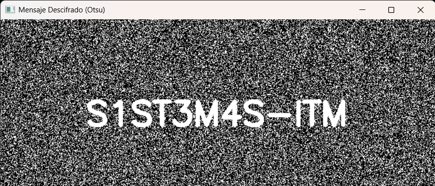
- Canal B (Azul):
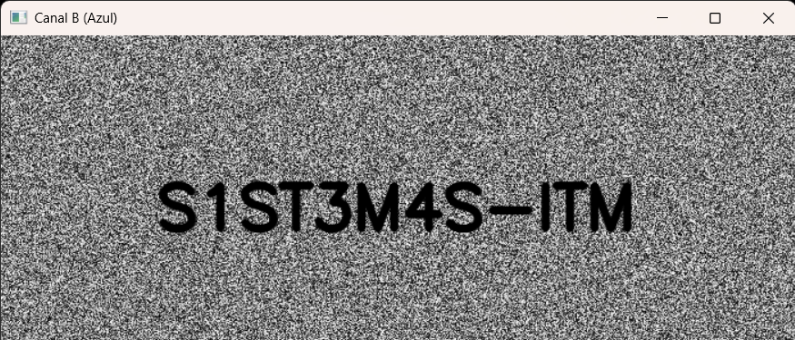
- Canal G (Verde):
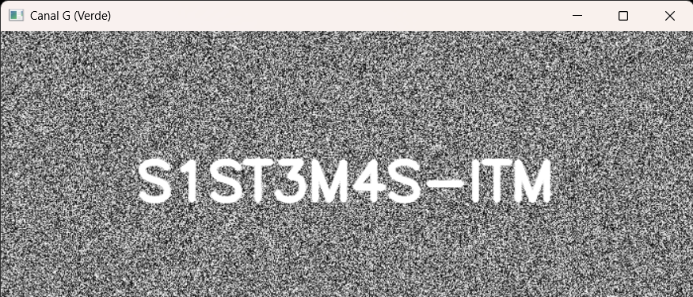
- Diferencia abs:
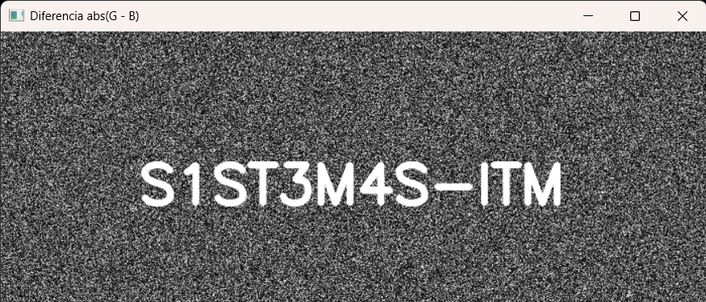
- Evidencia tricolor:
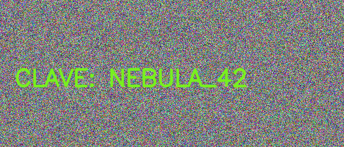
- Código:
```python
import cv2
import numpy as np

# ==========================================
# 1. GENERACIÓN DEL MENSAJE (m5_tricolor.png)
# ==========================================

# Crear imagen de 300x700 con ruido aleatorio en BGR (valores entre 0 y 255)
# Nota: La estructura de tamaño en numpy es (alto, ancho, canales) -> (300, 700, 3)
img_ruido = np.random.randint(0, 256, (300, 700, 3), dtype=np.uint8)

# Configuración del texto "tramposo"
texto_secreto = "S1ST3M4S-ITM"
fuente = cv2.FONT_HERSHEY_SIMPLEX
escala = 1.8
grosor = 5

# Calcular coordenadas para centrar el texto
tamaño_texto = cv2.getTextSize(texto_secreto, fuente, escala, grosor)[0]
x_texto = (700 - tamaño_texto[0]) // 2
y_texto = (300 + tamaño_texto[1]) // 2

# TINTA TRAMPOSA: Usaremos un color donde G = 255, B = 0, R = 128
# Al ojo humano se verá como un verde/oliva mezclado con el ruido, 
# pero la diferencia matemática entre G y B será enorme (255 - 0 = 255).
color_tramposo = (0, 255, 128) # Formato BGR

cv2.putText(img_ruido, texto_secreto, (x_texto, y_texto), fuente, escala, color_tramposo, grosor, cv2.LINE_AA)

# Guardar la evidencia generada
cv2.imwrite("m5_tricolor.png", img_ruido)
print("¡Imagen 'm5_tricolor.png' generada con el mensaje oculto!")


# ==========================================
# 2. RECUPERACIÓN DEL MENSAJE
# ==========================================

# Volvemos a cargar la imagen para simular la intercepción
img = cv2.imread("m5_tricolor.png")

# Separar los canales B, G, R
b, g, r = cv2.split(img)

# Probar la combinación matemática: Valor absoluto de la diferencia entre G y B
# Como en el texto G=255 y B=0, la diferencia será 255 (Blanco puro)
combinacion_gb = cv2.absdiff(g, b)

# Para asegurar que el texto sea perfectamente legible y contrastado,
# aplicamos una umbralización (Thresholding). En este caso, el método de Otsu
# calculará automáticamente el mejor umbral para separar el texto del fondo.
_, mensaje_umbralizado = cv2.threshold(combinacion_gb, 0, 255, cv2.THRESH_BINARY + cv2.THRESH_OTSU)

# Guardar el resultado final recuperado
cv2.imwrite("m5_mensaje.png", mensaje_umbralizado)
print("¡Mensaje recuperado con éxito y guardado como 'm5_mensaje.png'!")


# ==========================================
# 3. VISUALIZACIÓN (Opcional)
# ==========================================
cv2.imshow("Canal B (Azul)", b)
cv2.imshow("Canal G (Verde)", g)
cv2.imshow("Diferencia abs(G - B)", combinacion_gb)
cv2.imshow("Mensaje Descifrado (Otsu)", mensaje_umbralizado)

cv2.waitKey(0)
cv2.destroyAllWindows()
```
---
## Análisis del Analista (Reflexiones Finales)

1. **Operadores puntuales (M1):** ¿Qué diferencia visual hay entre recuperar con multiplicación (x50) y recuperar con suma (+50)? ¿Cuál preserva mejor el contraste del texto?
> Con la multiplicación (x50): La imagen de verdad se recupera. El fondo y las letras se separan por completo, haciendo que el texto oculto se note clarito y súper legible.
Con la suma (+50): La imagen solo se aclara de forma uniforme, o sea, se vuelve un gris plano. El texto sigue estando súper camuflado y no se entiende nada porque todo subió en la misma cantidad.

2. **Transformaciones geométricas (M2):** ¿Por qué es importante escoger el centro correcto al rotar una imagen con `getRotationMatrix2D`?
> Porque el centro es el "eje" o el pin sobre el que gira toda la imagen. Si no eliges el centro correcto (el punto medio exacto de la pieza del QR), la imagen no solo va a rotar los 180°, sino que se va a desplazar de su lugar y terminará volando fuera del lienzo o desalineada. Al elegir el centro exacto, la mitad del QR gira sobre sí misma en su propio eje, lo que permite que luego ensamble a la perfección y sin solaparse con la otra mitad.

3. **Convolución (M4):** ¿Por qué un filtro promedio puede ayudar a reducir falsos positivos antes de segmentar por HSV, y qué desventaja tiene sobre los bordes del texto?
> Ayuda porque el filtro promedio funciona como un difuminador. Lo que hace es "suavizar" esos píxeles sueltos y locos del ruido mezclándolos con los vecinos. Así, esos puntitos ya no alcanzan el tono Cyan que busca la máscara de HSV, limpiando la imagen y evitando falsos positivos (manchas falsas).
Su desventaja: La mala noticia es que, como el filtro promedia todo por igual, también difumina y borra los bordes del texto. Las letras pierden nitidez, se ven borrosas o "fofas", y si el texto es muy delgado, se puede llegar a perder o hacer más difícil de leer después de segmentar.

4. **Canales (M5):** ¿Por qué separar canales puede revelar información que en la imagen a color “no se ve” a simple vista?
> A simple vista no lo notamos porque nuestro ojo (y la pantalla) ve la mezcla de los tres canales (BGR) al mismo tiempo; si hay mucho ruido de fondo de todos los colores, el cerebro se confunde y camufla el texto. Pero si el enemigo usó una "tinta tramposa" alterando solo el canal Verde (G), por ejemplo, al separar los canales con cv2.split(), el ruido de los canales Azul y Rojo desaparece de la ecuación. Al quedarnos con el canal G solito en escala de grises, el texto salta a la vista de inmediato porque ya no tiene los otros colores encima estorbando.